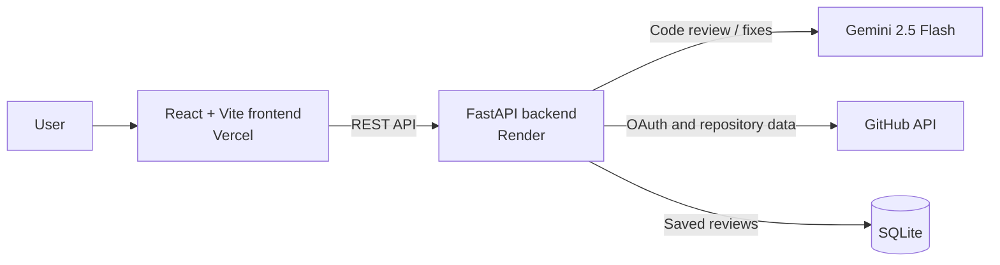

# Code Analyzer

An AI-powered code review tool that finds bugs, security concerns, performance problems, and style issues in pasted code or files from a connected GitHub repository.

**Live demo:** [code-analyzer-nu.vercel.app](https://code-analyzer-nu.vercel.app/)  
**API:** [code-analyzer-api-tcop.onrender.com](https://code-analyzer-api-tcop.onrender.com/)

## Features

- Analyze pasted code with Gemini 2.5 Flash.
- Receive a 0–100 quality score, concise summary, and severity-grouped issues.
- See the exact line number, category, explanation, and suggested correction for each issue.
- Apply an AI-generated correction to the editor with one click.
- Connect GitHub with OAuth, browse repositories and files, and review selected files.
- Save and revisit completed reviews locally through the review history page.

## Architecture



## Tech stack

| Layer | Technology |
| --- | --- |
| Frontend | React, TypeScript, Vite, Tailwind CSS, Monaco Editor |
| Backend | FastAPI, SQLAlchemy, HTTPX |
| AI | Google Gemini 2.5 Flash |
| Authentication | GitHub OAuth 2.0 |
| Database | SQLite |
| Deployment | Vercel (frontend), Render (backend) |

## Run locally

### Prerequisites

- Node.js 20 or later
- Python 3.10 or later
- A Gemini API key
- A GitHub OAuth App (required only for the GitHub workspace)

### 1. Clone the repository

```bash
git clone https://github.com/divyanshu-7870/Code_Analyzer.git
cd Code_Analyzer
```

### 2. Configure and run the backend

```bash
cd backend
python3 -m venv .venv
source .venv/bin/activate
pip install -r requirements.txt
cp .env.example .env
```

Update `backend/.env` with your credentials:

```dotenv
GEMINI_API_KEY=your_gemini_api_key
GITHUB_CLIENT_ID=your_github_oauth_client_id
GITHUB_CLIENT_SECRET=your_github_oauth_client_secret
BACKEND_URL=http://localhost:8000
FRONTEND_URL=http://localhost:5173
CORS_ORIGINS=http://localhost:5173
```

Start the API:

```bash
uvicorn app.main:app --reload --host 0.0.0.0 --port 8000
```

The API will be available at `http://localhost:8000`.

### 3. Configure and run the frontend

In a second terminal:

```bash
cd frontend
npm install
cp .env.example .env
npm run dev
```

`frontend/.env` should point to the local API:

```dotenv
VITE_API_BASE_URL=http://localhost:8000
```

Open `http://localhost:5173`.

### GitHub OAuth callback for local development

In your GitHub OAuth App settings, add this authorization callback URL:

```text
http://localhost:8000/api/github/callback
```

For deployment, use the corresponding deployed backend callback URL and set `BACKEND_URL`, `FRONTEND_URL`, and `CORS_ORIGINS` in the backend host.

## API reference

The backend serves all application routes under `/api`.

### `POST /api/review`

Reviews pasted code and stores the completed review.

```json
{
  "code": "function add(a, b) { return a + b; }",
  "language": "javascript"
}
```

Response:

```json
{
  "issues": [
    {
      "line_number": 1,
      "severity": "low",
      "category": "style",
      "description": "...",
      "suggestion": "...",
      "fixed_code_snippet": "..."
    }
  ],
  "score": 97,
  "summary": "..."
}
```

### `POST /api/apply`

Applies a selected suggested fix to the complete source code.

```json
{
  "original_code": "...",
  "language": "javascript",
  "issue_description": "...",
  "suggestion": "...",
  "fixed_code_snippet": "..."
}
```

### `GET /api/history`

Returns saved reviews, newest first.

### GitHub routes

| Endpoint | Purpose |
| --- | --- |
| `GET /api/github/login` | Starts the GitHub OAuth flow. |
| `GET /api/github/callback` | Handles GitHub's OAuth callback. |
| `GET /api/github/repos?token=<token>` | Lists accessible repositories. |
| `GET /api/github/tree?token=<token>&repo=<owner/repo>` | Lists repository files. |
| `GET /api/github/file?token=<token>&repo=<owner/repo>&path=<path>` | Retrieves one file's content. |
| `POST /api/github/review-file?token=<token>&repo=<owner/repo>&path=<path>` | Reviews a selected GitHub file and saves the result. |

## Environment variables

| Variable | Required | Description |
| --- | --- | --- |
| `VITE_API_BASE_URL` | Frontend | URL of the FastAPI backend. |
| `GEMINI_API_KEY` | Backend | API key used for Gemini reviews and fixes. |
| `GITHUB_CLIENT_ID` | Backend | GitHub OAuth App client ID. |
| `GITHUB_CLIENT_SECRET` | Backend | GitHub OAuth App client secret. |
| `BACKEND_URL` | Backend | Public backend URL used to form the OAuth callback URL. |
| `FRONTEND_URL` | Backend | Public frontend URL used after OAuth completes. |
| `CORS_ORIGINS` | Backend | Comma-separated frontend origins allowed to call the API. |

Never commit real API keys, OAuth secrets, or access tokens. Use the provided `.env.example` files as templates.

## Project structure

```text
Code_Analyzer/
├── frontend/               # React application
│   └── src/
│       ├── pages/          # Analyze, GitHub, and History screens
│       ├── services/       # API clients
│       └── components/     # UI and editor components
├── backend/
│   └── app/
│       ├── routes/         # Review, history, and GitHub endpoints
│       ├── services/       # Gemini integration
│       ├── models/         # SQLAlchemy models
│       └── schemas/        # Request/response schemas
└── render.yaml             # Render deployment blueprint
```

## License

This project is intended for learning and portfolio use. Add a license file before distributing it for broader reuse.
